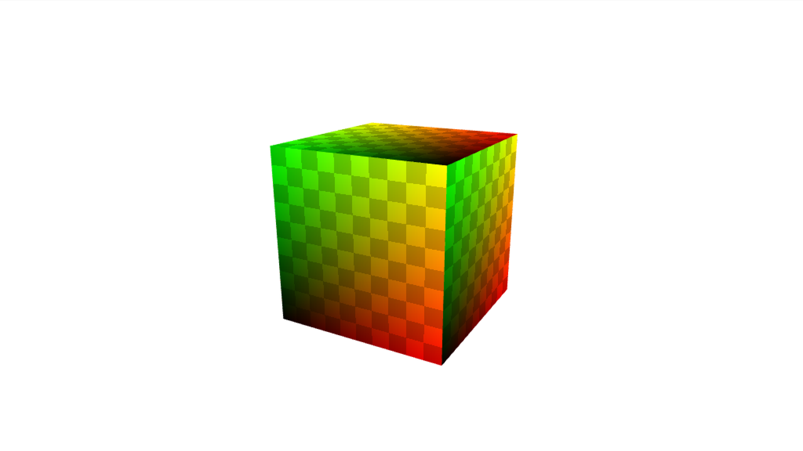

# primitive-cube

[](http://github.com/badges/stability-badges)

A minimal cube geometry for 3D rendering, including normals, UVs and cell indices (faces).

## Usage

[](https://www.npmjs.com/package/primitive-cube)

#### `mesh = createCube([sx, sy, sz, nx, ny, nz])`

Parameters:  
`sx` - size x, defaults to 1  
`sy` - size y, defaults to `sx`  
`sz` - size z, defaults to `sx`
`nx` - num subdivisions on x axis, defaults to 1  
`ny` - num subdivisions on y axis, defaults to `sx`  
`nz` - num subdivisions on z axis, defaults to `sx`

## Example

```javascript
var createCube = require('primtivie-cube');
var cube = createCube(1, 1, 1, 3, 3, 3);
```

`cube` will have the following structure:

```
{
  positions: [ [x, y, z], [x, y, z], ... ],
  cells: [ [a, b, c], [a, b, c], ... ],
  uvs: [ [u, v], [u, v], ... ],
  normals: [ [x, y, z], [x, y, z], ... ]
}
```

## Demo

Download or clone this repo and run:

```
cd demo
npm install
npm start
```

## License

MIT, see [LICENSE.md](http://github.com/vorg/primitive-cube/blob/master/LICENSE.md) for details.
